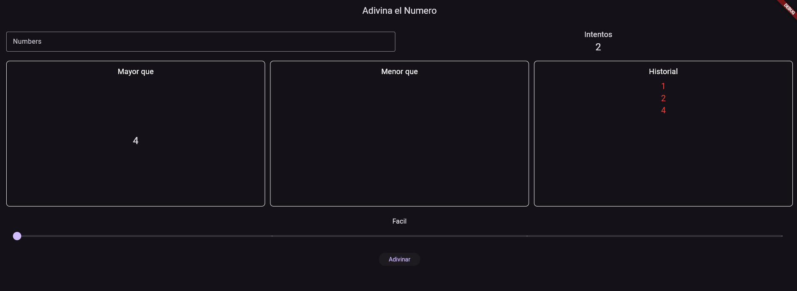
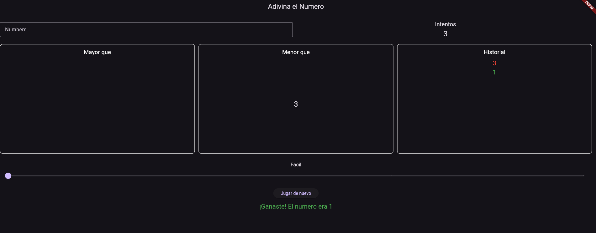
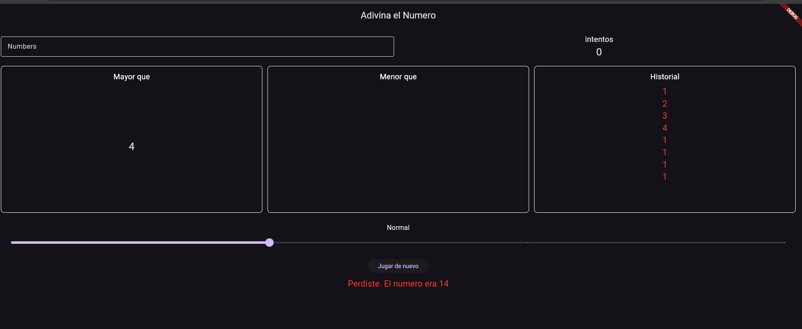

# AdivinaElNumero-Desafio

Juego en Flutter para adivinar un número secreto dentro de un rango. El rango y la cantidad de intentos cambian según el nivel de dificultad seleccionado.

## Demo

### Partida en curso


### Victoria


### Derrota


## Niveles de dificultad

- **Fácil**: números del 1 al 10, con 5 intentos.
- **Medio**: números del 1 al 20, con 8 intentos.
- **Avanzado**: números del 1 al 100, con 15 intentos.
- **Extremo**: números del 1 al 1000, con 25 intentos.

## Qué hace la app

- Al seleccionar un nuevo nivel de dificultad, el juego se reinicia automáticamente, estableciendo un nuevo número secreto y reajustando el contador de intentos.
- Valida la entrada del usuario. Las entradas inválidas como letras, caracteres especiales o números fuera del rango son rechazadas con mensajes de error claros.
- La columna "Mayor que" muestra el número más cercano que ingresamos y que es mayor al número a adivinar.
- La columna "Menor que" muestra el número más cercano que ingresamos y que es menor al número a adivinar.
- La columna "Historial" almacena todos los intentos, en verde cuando acertamos y en rojo cuando erramos. Las columnas son scrollables.
- Al finalizar el juego se muestra el número secreto en color verde si el jugador ganó o en rojo si perdió.

## Cómo correr el proyecto

Requisitos: tener Flutter instalado ([guía oficial](https://docs.flutter.dev/get-started/install)).

```bash
git clone https://github.com/Jaredsanz/AdivinaElNumero-Desafio.git
cd AdivinaElNumero-Desafio
flutter pub get
flutter run
```

## Estructura

```
lib/
├── main.dart         # UI y lógica del juego
└── modelos/
    └── nivel.dart    # Modelo Nivel y configuración de los 4 niveles
```

## Autor

Jared Sánchez — [@Jaredsanz](https://github.com/Jaredsanz)
